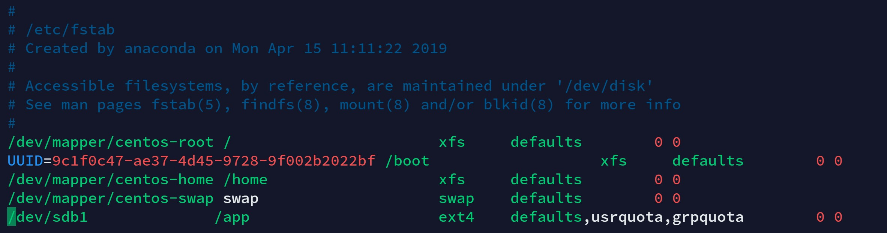
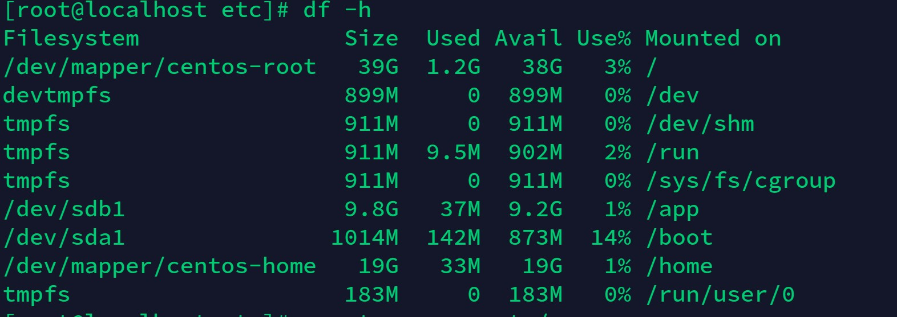
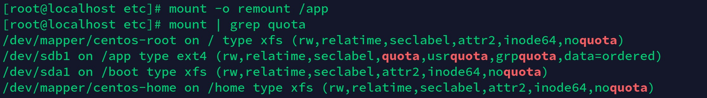
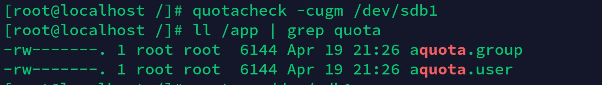
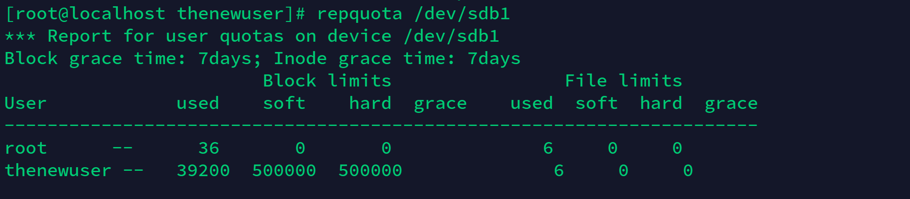

# Linux-disk-quota-management-project
[TOC]
***
>**ssh tools**：Termius
>
>**Virtual Machine**：vmware 14
>**Markdown**：印象笔记 & Typora

### Linux Set up the network card when boot
1. Enter the terminal
```
cd /etc/sysconfig/network-scripts
```
2. Vi opens the corresponding network card configuration file. Centos defaults to ens33 and most other systems to enth0
```
vi ifcfg-ens33
```
3. Change ONBOOT=no     to     ONBOOT=yes  Wq save

4. Restart the system, you will find that the network card has been booted with boot

### Configure system disk 60GB+ storage disk 10GB
1. Perform ` ` ` fdisk -l ` ` ` view new add hard disk, you can see the SDB for the newly added the hard disk.

2. ```fdisk /dev/sdb```Format new hard disk

3. Enter m to see help

4. Enter n to create a new partition, p to create a new primary partition, and 1 (primary partition number) to start and end the disk partition respectively.

5. Enter w to save the partition

6. ```Fdisk -l ` ` ` view partitions, with sdb1;

7. Input ` ` ` MKFS. Corruption ` ` ` partitions formatted into corruption format

8. Edit /etc/fstab and add at the bottom:

  / dev/sdb1 / app corruption defaults 0 0

  Make the disk boot mount to the /app directory

### Modify the kernel fstab to open the disk quota limit on the root directory
```
vim /etc/fstab 
```


The marked places are the places that need to be added. This means that the disk quota limit is applied to the root directory. Of course, it can also be added to other lines, which means that the disk quota limit is applied to other directories.

### View the directory mount location
```
df -h
```


### The root partition is remounted and the kernel reads the /etc/fstab file again
```
mount -o remount /app
mount | grep quota
```


### install quota
```
yum install quota
```

### Generate the quota configuration file in the root directory through the quotacheck command
```
quotacheck -cugm /dev/sdb1
ll / | grep quota
```


### Boot disk quota
```
quotaon /dev/sdb1
```

### Create a user in /app/data
```
mkdir thenewuser #记得更改文件权限
cp .bash_logout  .bash_profil  .bashrc /app/data/thenewuser
useradd -m -d /app/data/thenewuser thenewuser
```

### Open to user
```
edquota -u thenewuser
```

### Simulate large file writes
```
dd if=/dev/zero of=/app/data/file1 bs=1M count=450  #未超上限，无报错
dd if=/dev/zero of=/app/data/file2 bs=1M count=450  #报错
```


### View disk usage
```
repquota /dev/sdb1
```


### The script text
```


!/bin/bash
#userlist=cat /etc/passwd | awk 'BEGIN {FS=":"}{print $1}'
TEXT1=`cat "/etc/passwd"`
DATE=`date "+%Y-%m-%d_%H-%M"`
echo $DATE
USERNUMBER=`wc -l /etc/passwd|cut -d' ' -f1`
echo $USERNUMBER
USERALLLIST=`echo "$TEXT1" | awk 'BEGIN {FS=":"}{print $1}'`

echo $USERALLLIST
echo "********************************************************************************************************"
for((i=1;i<=$USERNUMBER;i++));do
    echo "这是第 $i 个用户";
    FORUSER=`cut -d: -f1 /etc/passwd | head -$i | tail -1`
    echo $FORUSER
    #CHECKFULLUSER=`repquota /dev/sdb1 | grep $FORUSER | tr -s ' ' |cut -d ' ' -f1`
    CHECKFULLUSED=`repquota /dev/sdb1 | grep $FORUSER | tr -s ' ' |cut -d ' ' -f3`
    CHECKFULLUSED=${CHECKFULLUSED:=0} #若 num 为空或未设置时，则 num 设为值 0
    #echo $CHECKFULLUSER
    echo $CHECKFULLUSED
    if [ $CHECKFULLUSED -eq 500000 ]
    then
       echo "over used"
       mkdir overuseddata-$FORUSER
       mv ./overuseddata-$FORUSER /app/overuseddata
       mv /app/data/$FORUSER/* /app/overuseddata/overuseddata-$FORUSER  #移动所有滥用文件到overuseddata（不包括隐藏的配置文件）
       tar -czvf $FORUSER-$DATE.tar.gz /app/overuseddata/overuseddata-$FORUSER
       mv /app/$FORUSER-$DATE.tar.gz /app/overuseddata
       rm -Rf /app/overuseddata/overuseddata-$FORUSER
       echo "文件已移动"    
    elif [ $CHECKFULLUSED -gt 500000 ]
    then
       echo "over used"
       mkdir overuseddata-$FORUSER
       mv ./overuseddata-$FORUSER /app/overuseddata
       mv /app/data/$FORUSER/* /app/overuseddata/overuseddata-$FORUSER  #移动所有滥用文件到overuseddata（不包括隐藏的配置文件）
       tar -czvf $FORUSER-$DATE.tar.gz /app/overuseddata/overuseddata-$FORUSER
       mv /app/$FORUSER-$DATE.tar.gz /app/overuseddata
       
rm -Rf /app/overuseddata/overuseddata-$FORUSER
       echo "文件已移动" 
    else
       echo "used well"
    fi
done;
```